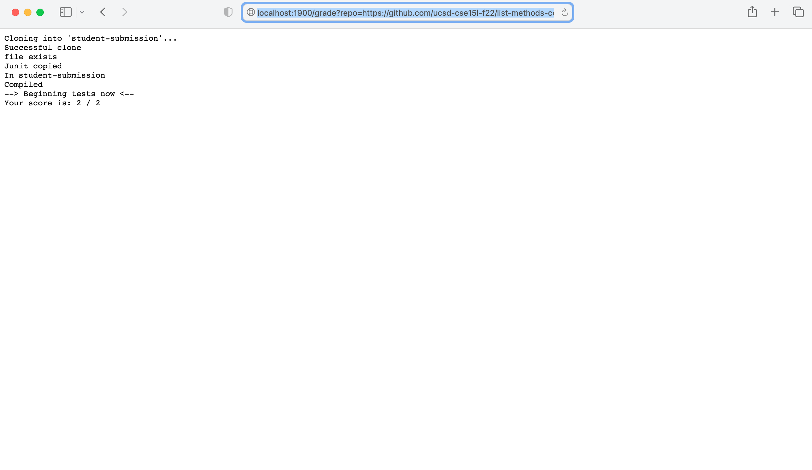
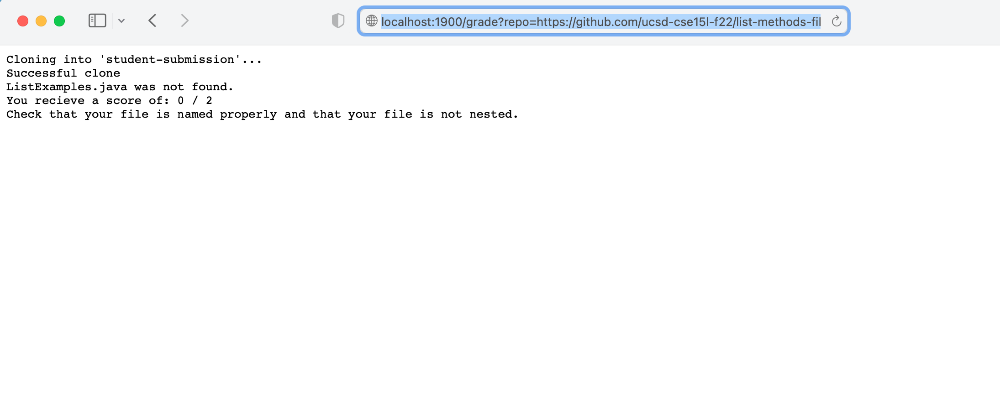

**Lab Report 5** <br>
*My Partner for this assignment is Matthew Zabaco*


**The Script** <br>

```
# Create your grading script here

#set -e

JU=".:lib/hamcrest-core-1.3.jar:lib/junit-4.13.2.jar"

rm -rf student-submission
git clone $1 student-submission

echo "Successful clone"

FILE=student-submission/ListExamples.java

if  [ -f "$FILE" ]; then
    echo "file exists"
else
    echo "ListExamples.java was not found."
    echo "You recieve a score of: 0 / 2"
    echo "Check that your file is named properly and that your file is not nested."
    exit 1
fi

cp -r lib student-submission
echo "Junit copied"

cp TestListExamples.java student-submission/
cd student-submission
echo "In student-submission"

# Score of the tests. Starts at value 0 and increases
# when qualifications are met.
# out of 2
SCORE=0

javac -cp $JU *.java 2> CompileErr.txt
if [[ $? -ne 0 ]]; then
    echo "Your code did not compile. You recieve a $SCORE."
    exit 1
fi
echo "Compiled"

echo "--> Beginning tests now <--"

java -cp $JU org.junit.runner.JUnitCore TestListExamples > JunitOut.txt

grep -q "2 tests" JunitOut.txt
if [[ $? -eq 0 ]]; then
    SCORE=2
fi
grep -q "Failures: 1" JunitOut.txt
if [[ $? -eq 0 ]]; then
    SCORE=1
fi


echo "Your score is: $SCORE / 2"

```


Github repo w/ good implementation which passes all test cases:
!
This sample repository has a good implementation of List Methods so their code passes both of our tests. We gave each test a weight of one point, so their code earned a score of 2/2.

Github repo w/ compile error
!
This sample repository has a compile error so we couldn't run and score it, so it gets a score of 0/2. We do let the student know that their file
has a compile error, so they know what they need to fix when they resubmit.

Github repo w/ wrong filename
!
Similar to the repository with the compiler error, this repository has a file saved with the wrong name, so we do not give it any credit. However, we
do instruct the student to check their file is saved with the correct name.


