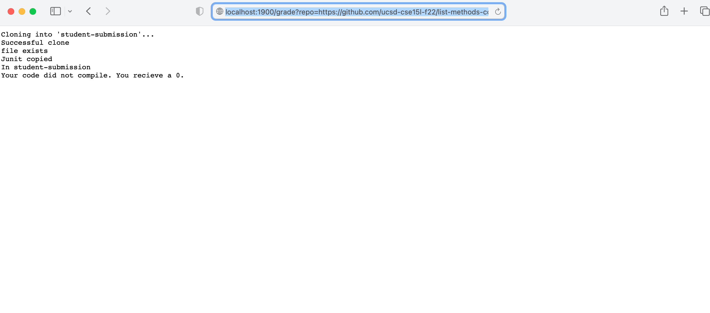

**Lab Report 5**  
*My Partner for this assignment is Matthew Zabaco*

Github repo w/ good implementation which passes all test cases:
!
This sample repository has a good implementation of List Methods so their code passes both of our tests. We gave each test a weight of one point, so their code earned a score of 2/2.

Github repo w/ compile error
!
This sample repository has a compile error so we couldn't run and score it, so it gets a score of 0/2. We do let the student know that their file
has a compile error, so they know what they need to fix when they resubmit.

Github repo w/ wrong filename
!
Similar to the repository with the compiler error, this repository has a file saved with the wrong name, so we do not give it any credit. However, we
do instruct the student to check their file is saved with the correct name.

