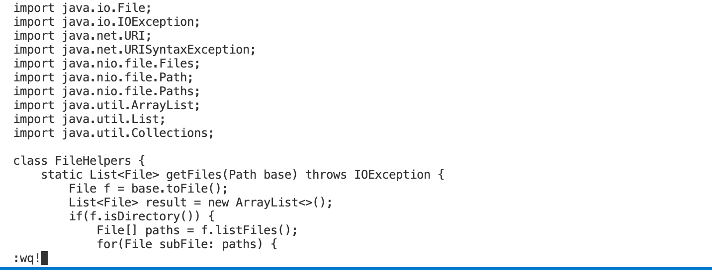

**Lab Report 4: VIM**

**PART 1**

 
**Change all the uses of start to base**

Commands Used we first use /start to search for start, then we hit enter which jumps to the first entry of start. <br>
Then we say ce which removes start, then we enter base. The we say n which jumps to the next word start, then . to replace that word.<br>
Then again we hit n to jump to the next start, then . to replace that word. Then we are done because all of our starts have been 
modfied to base.
<br>

So the keys we hit are(not including the seperating commas) ```/start, <enter>, ce, base, <Esc>, n., n. ``` : 
 this is a total of 18 keys pressed.
 If we count saving and quiting the file which has a command of ```:wq!``` then we have 22 keys pressed. 
 
 <br>
 
 Screenshot 1:
 
 Expanation: This is me entering "/start" to search for the first occurence of start. You can see it jumps to and hightlights start. <br>
 Screenshot 2: 
 
  Expanation: This is after me entering "ce" which clears that entry now we need to enter "base". <br>
 
 Screenshot 3:
 
 Expanation: This is my screen after entering "base" now we need to <escape>. <br>
 
  
 Screenshot 4:
 
  Expanation: After entering "n." we jump to the next entry entry of start and change it base. Repeat "n." one more time to change the last start to base. <br>
 
  Screenshot 5:
 
  Expanation: After entering ":wq!" we save and quit our vim edits. Now all occurences of start are changed to base. <br>
 
 
 
 

 
**Part 2**
 
 Option 1: Start in visual studio code then copy the changes over to the remote server. <br>
 This took me four minutes, the commands I made to edit the file were fast within two minutes, but when I copied the changes over I forgot the :~ at the end of the scp command. This took me a minute to figure out, but once I did everything worked as expected. <br>
 
 Option 2: start in ssh and make the changes there. <br>
 This took approximately 2.5 minutes. I found this approach a lot easier because I didnt have to copy and files over at the end and this saved me a lot of time to complete the process unlike the first approach where I got stuck on scp.
 
 
 
 
 
 
 *Which of these two styles would you prefer using if you had to work on a program that you were running remotely, and why?* <br>
 I would prefer to make the edits while logged into the remove server. My first reason is the command for scp is very long and I often forget the :~ at the end of the command which can cause issues. I also think working on things remotely is nice because you do not have to store any files on your own computer. <br>
 
 *What about the project or task might factor into your decision one way or another? (If nothing would affect your decision, say so and why!)* <br>
Say there are many files I want to make edits to, I would not want to copy a large amount of files over from my local computer because that can be quite time consuming. Asides from that, I would not mind doing either because I think it is important to be able to do both.
 
 
