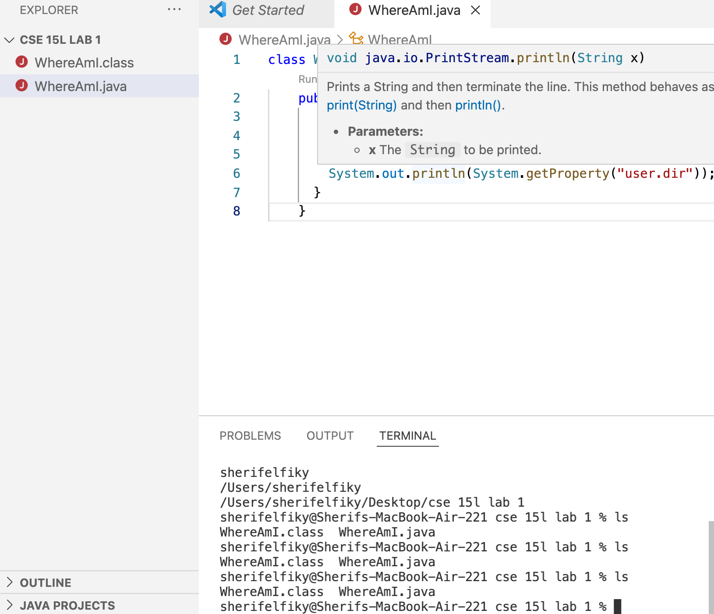

Hello, here you will learn how to log into a course specific account using vscode. You can open your browser search for vscode installation, then download it to your computer.

To remotely connect you will open your vscode terminal
![terminal][new terminal.png]

Then you will enter ssh cs15lfa22(your two letters here)@ieng6.ucsd.edu
You will be prompted for your password enter your course specific password

