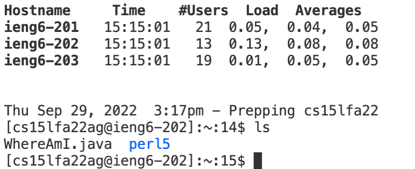

Hello, here you will learn how to log into a course specific account using vscode. You can open your browser search for vscode installation, then download it to your computer.

To remotely connect you will open your vscode terminal
![terminal][new terminal.png]

Then you will enter ssh cs15lfa22(your two letters here)@ieng6.ucsd.edu
You will be prompted for your password enter your course specific password, enter that and you should see the following output from terminal.

You can run commands from the remote server like ls and cd. Here is a picture of what I saw when I entered ls.

For the next step you will need to copy and paste the following code into a java file in vs code:
class WhereAmI {
  public static void main(String[] args) {
    System.out.println(System.getProperty("os.name"));
    System.out.println(System.getProperty("user.name"));
    System.out.println(System.getProperty("user.home"));
    System.out.println(System.getProperty("user.dir"));
  }
}

When you run that program you should see a similar output in your terminal(replace my information with yours)

