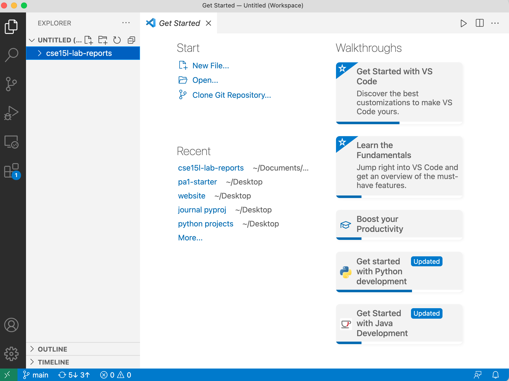
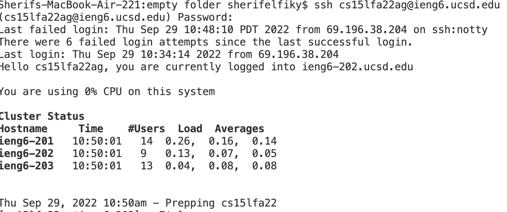
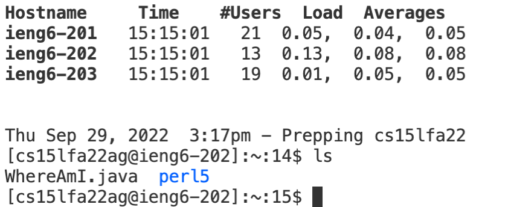
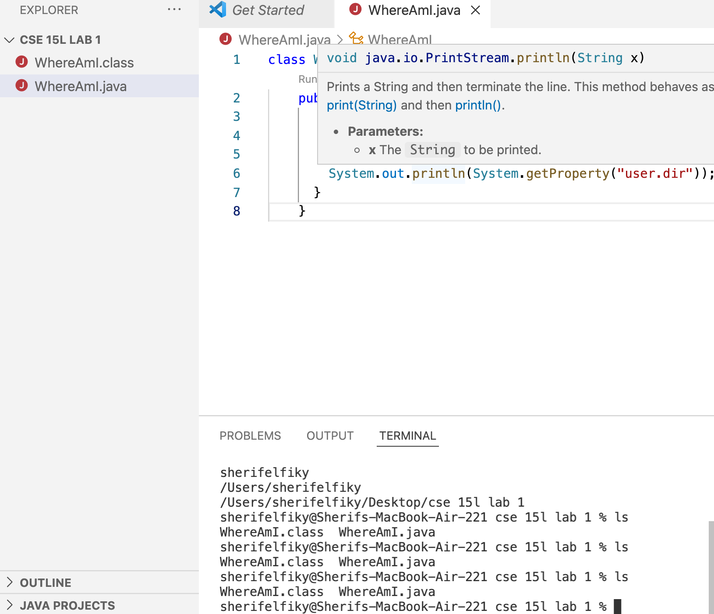
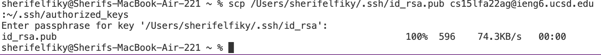
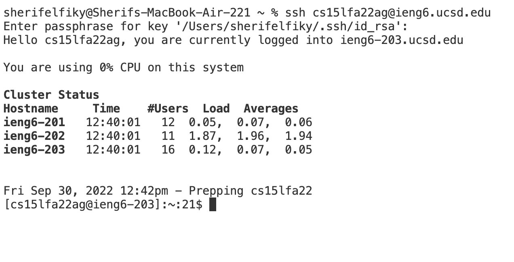
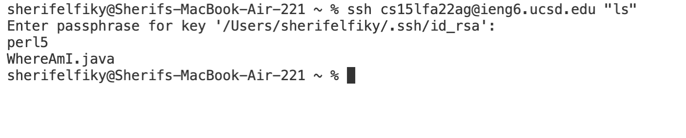

**Hello, here you will learn how to log into a course specific account using vscode. **
**(1) Install VSCODE
**You can open your browser search for vscode installation, then download it to your computer.**

**(2) Remotely Connecting
To remotely connect you will open your vscode terminal
![new terminal][newterminal.png]

Then you will enter ssh cs15lfa22(your two letters here)@ieng6.ucsd.edu
You will be prompted for your password enter your course specific password, enter that and you should see the following output from terminal.

**(3) Try Some Commands**
You can run commands from the remote server like ls and cd. Ls lists all the files in your current directory. The command cd is used to change your current working directory.

Here is a picture of what I saw when I entered ls.

For the next step you will need to copy and paste the following code into a java file in vs code:
`
class WhereAmI {
  public static void main(String[] args) {
    System.out.println(System.getProperty("os.name"));
    System.out.println(System.getProperty("user.name"));
    System.out.println(System.getProperty("user.home"));
    System.out.println(System.getProperty("user.dir"));
  }
}
`

When you run that program you should see a similar output in your terminal(replace my information with yours)

**(4) Moving files with SCP**
Now you can use the command scp WhereAmI.java cs15lfa22(your two letters here)@ieng6.ucsd.edu:~/
This will allow the java file to be copied to the server.
SSH back into the server and hit ls, you should see WhereAmiI.java there.

**(5) Setting an SSH Key**

Moving on enter ssh-keygen, you will be promted to enter a file, hit enter to choose the default file. You will then be promted to enter a password.
Once you do this you will have created two files the private: id_rsa and the public : id_rsa.pub which is stored on your computer.
copy the public file to your computer by doing the following. SSH with your password you created.

(your computer) log into your remote account
$ ssh cs15lfa22(your two letters)@ieng6.ucsd.edu
<Enter Password>

(on the server) create an SSH directory
enter mkdir .ssh
then enter exit 
(back on your computer again)

scp the public key into your remote SSH directory.
now enter : scp /Users/(your name)/.ssh/id_rsa.pub cs15lfa22(your two letters here)@ieng6.ucsd.edu:~/.ssh/authorized

Now you should be able to ssh and scp with your new password

**(6) Optimizing your remote running**
To omptimize your remote running you can ssh and write a command in quotes. This will allow you to take multiple commands and combine them into one efficienctly. For example:

This command will run right on the remote server and quit when it is finished.

**Note** you can also use a semicolon between commands to run two commands on the same line/at once.

