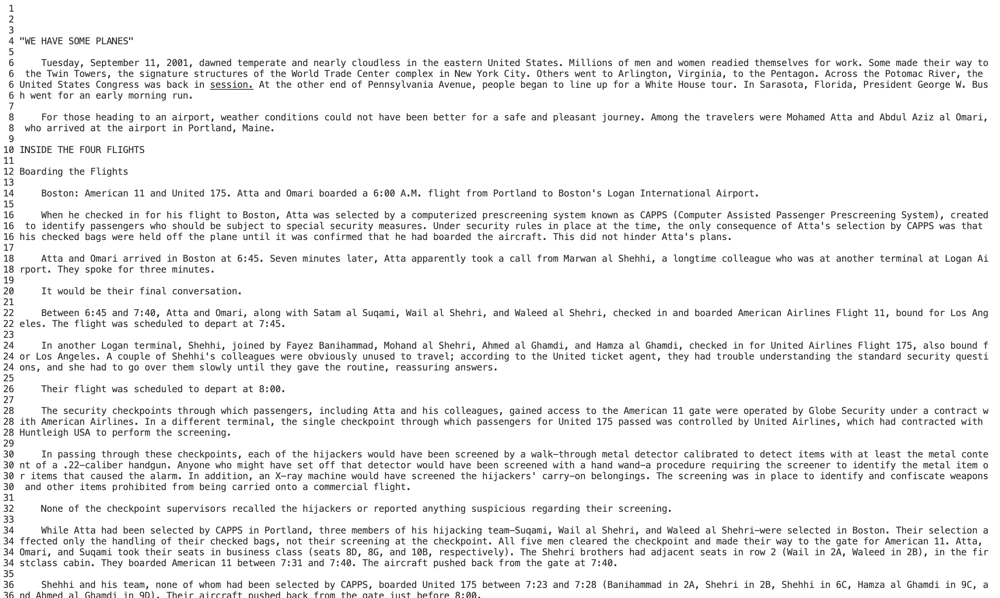

**Lab 3**

**Less**

One useful command option is less -N filename
Here is an example of me using the code in technical/911report/chapter-1.txt
the terminal commmands:
'''
cd technical/911report
less -N chapter-1.txt
'''
screenshot

**Find**

**Grep**
