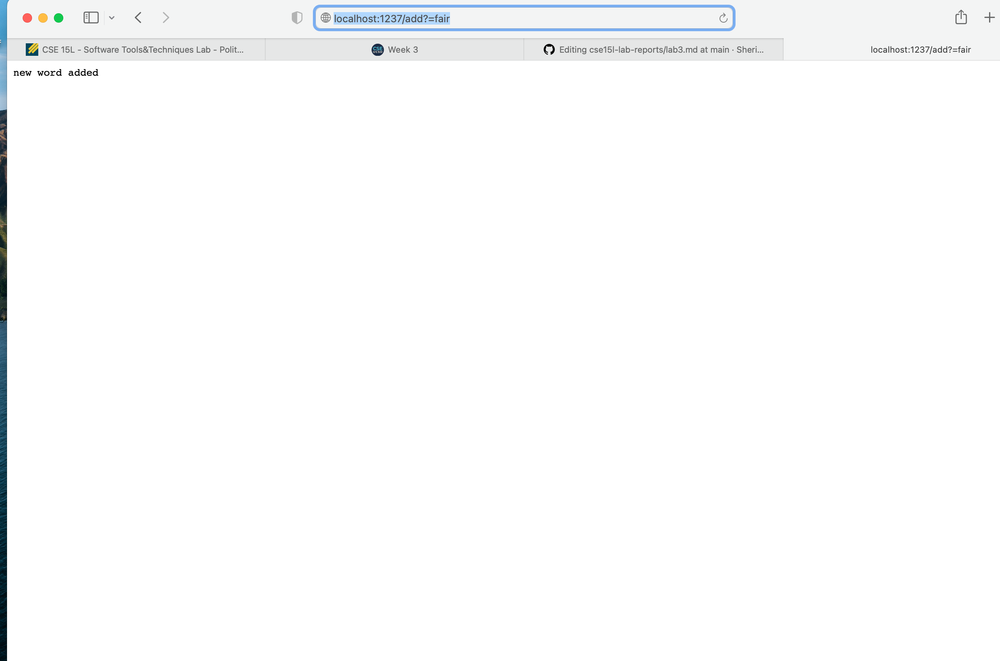
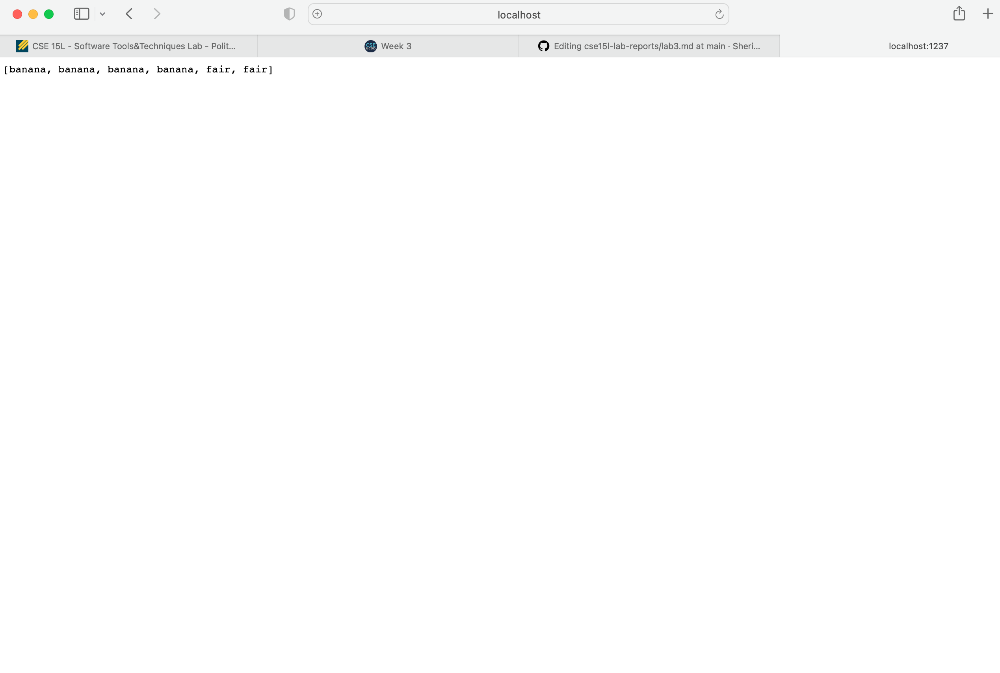
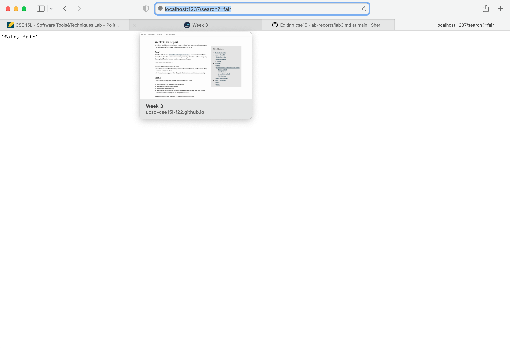

# Part 1
**Screenshots**

**Search Engine Code**

`import java.io.IOException;
import java.net.URI;
import java.util.Arrays;
import java.util.ArrayList;

class Handler implements URLHandler {
    // The one bit of state on the server: a number that will be manipulated by
    // various requests.
   
   int num = 0;
   ArrayList<String> paths = new ArrayList<>();
    public String handleRequest(URI url) {
        if (url.getPath().equals("/")) {
            return Arrays.toString(paths.toArray());
        } else if (url.getPath().contains("/add")) {
            String newAddition = url.getQuery().split("=")[1];
            paths.add(newAddition);
            return "new word added";
          }
            
         else if(url.getPath().contains("/search")) {
            String wordToSearch = url.getQuery().split("=")[1];
            ArrayList<String> wordsWithSubstring = new ArrayList<>();
            for (String path: paths){
                if (path.contains(wordToSearch)){
                    wordsWithSubstring.add(path);
                }
            }
            return Arrays.toString(wordsWithSubstring.toArray());

        }
            System.out.println("Path: " + url.getPath());
            if (url.getPath().contains("/add")) {
                String[] parameters = url.getQuery().split("=");
                if (parameters[0].equals("count")) {
                    num += Integer.parseInt(parameters[1]);
                    return String.format("Number increased by %s! It's now %d", parameters[1], num);
                }
            }
            return "404 Not Found!";
        }
    }

class SearchEngine {
    public static void main(String[] args) throws IOException {
        if(args.length == 0){
            System.out.println("Missing port number! Try any number between 1024 to 49151");
            return;
        }

        int port = Integer.parseInt(args[0]);

        Server.start(port, new Handler());
    }
}
`
*In this code I have an add method which will will take the path and check it for /add, if it is present it will check what comes after add seperated by equals and add that to an arraylist.
The search method works similarly. It takes the path and checks for /search, if this exists then the rest of what comes after will be checked and seperated by =. Then that word we are searching for gets saved into a String called wordToSearch. We then iterate through our existing list of Strings to check if any contain the substring. Any words that contain the substring get put into an arraylist called wordsWithSubstring. This arraylist is returned as an array.*

# Part 2
**Bug 1**
**In ArrayExamples.java**
**The Reversed Method**
'
static int[] reversed(int[] arr) {
    int[] newArray = new int[arr.length];
    for(int i = 0; i < arr.length; i += 1) {
      arr[i] = newArray[arr.length - i - 1];
    }
    return arr;
  }
'

**The failure inducing input**
*Any input produced a failure in this code*
**The Symptom**
*An array filled with zeros*
**The Bug**
'arr[i]  = newArray[arr.length - i - 1];'
*actually intends the statement*
'newArr[i] = arr[arr.length - i - 1];'
**The Connection**

*When we initiliaze newArray it becomes an array of length (arr.length) with zero value.*
 *Then we need to set the value of each index in newArr to the value in newArr starting from the last index in order to reverse the array.*
 *But when it is arr = newArr instead arr justs gets set to all zeros and newArr is still an array with all zeros*

**Picture of code and test**

**Bug 2**
**In LinkedListExamples.java**

**The failure inducing input**
'
 LinkedList list = new LinkedList();
        list.append(1);
        list.append(2);
        list.append(3);
        list.append(4);
        list.append(5);
        list.append(6);
        list.append(7);
        assertEquals(7, n.last());
        '
**The Symptom**
*The assert equals fails because n.last() is null.

**The Bug**
'
while(n.next != null) {
            n = n.next;
        }
        return n.value;
     '
     *The problem here is that we are saying until n.next is not equal to null and on the last iteration we say n = n.next which would always return the last as null.
     This only affects lists with size > 2 because the lists smaller have other conditionals that return the correct value for last.
     

**The Connection**
The while loop should have a conditional that says if (n.next == null) break, so that we stop right at the last non-null value in the linkedlist.
*For some reason the test was not working properly in vscode, but I was able to deduce the output by reading through the code for last method.*
**Screenshot of the test**

