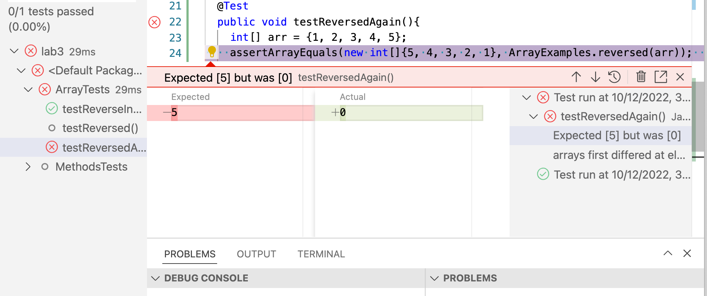
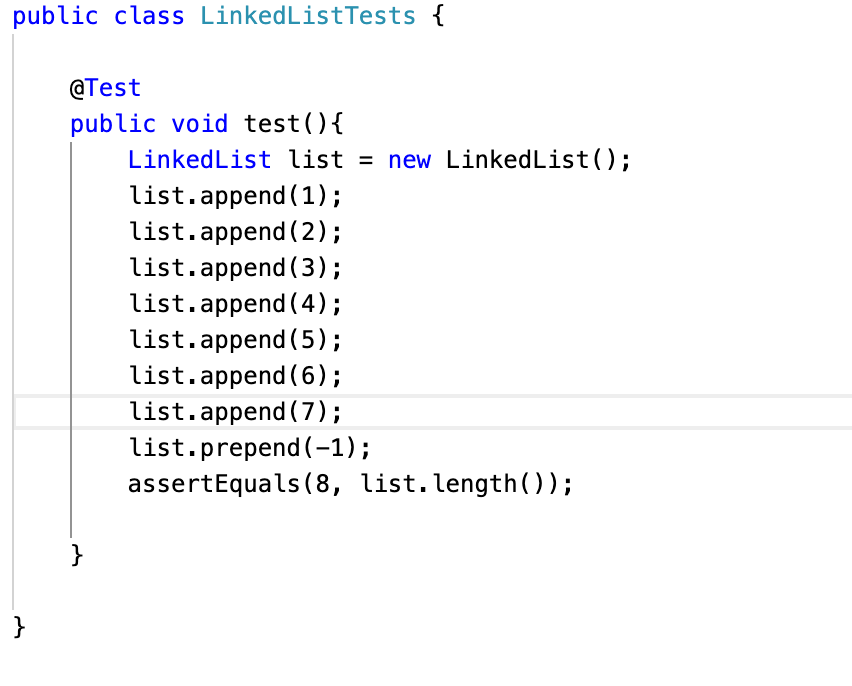

# Part 1
Code for the add 

`if (url.getPath().equals("/add")) {
            String[] newAddition = url.getQuery().split("=");
            if (newAddition[0].equals("s")) {
                paths.add(newAddition[1]);
                return "new word added: " + newAddition[1];

            }
        }`
     

# Part 2
**Bug 1**
**In ArrayExamples.java**
**The Reversed Method**
`
static int[] reversed(int[] arr) {
    int[] newArray = new int[arr.length];
    for(int i = 0; i < arr.length; i += 1) {
      arr[i] = newArray[arr.length - i - 1];
    }
    return arr;
  }
'

**The failure inducing input**
*Any input produced a failure in this code*
**The Symptom**
*An array filled with zeros*
**The Bug**
'arr[i]  = newArray[arr.length - i - 1];'
*actually intends the statement*
'newArr[i] = arr[arr.length - i - 1];'
**The Connection**

*When we initiliaze newArray it becomes an array of length (arr.length) with zero value.*
 *Then we need to set the value of each index in newArr to the value in newArr starting from the last index in order to reverse the array.*
 *But when it is arr = newArr instead arr justs gets set to all zeros and newArr is still an array with all zeros*

**Picture of code and test**

**Bug 2**
**In LinkedListExamples.java**

**The failure inducing input**
'
 LinkedList list = new LinkedList();
        list.append(1);
        list.append(2);
        list.append(3);
        list.append(4);
        list.append(5);
        list.append(6);
        list.append(7);
        assertEquals(7, n.last());
        '
**The Symptom**
*The assert equals fails because n.last() is null.

**The Bug**
'
while(n.next != null) {
            n = n.next;
        }
        return n.value;
     '
     *The problem here is that we are saying until n.next is not equal to null and on the last iteration we say n = n.next which would always return the last as null.
     This only affects lists with size > 2 because the lists smaller have other conditionals that return the correct value for last.
     

**The Connection**
The while loop should have a conditional that says if (n.next == null) break, so that we stop right at the last non-null value in the linkedlist.
*For some reason the test was not working properly in vscode, but I was able to deduce the output by reading through the code for last method.*
**Screenshot of the test**

