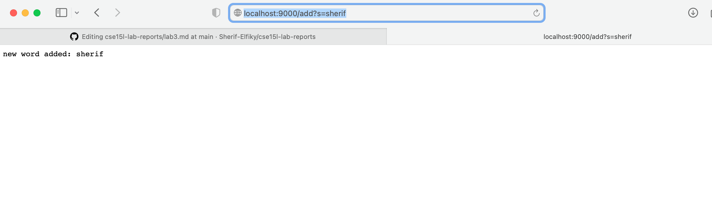
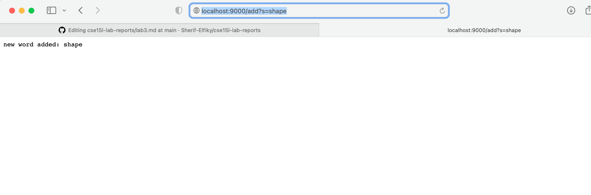
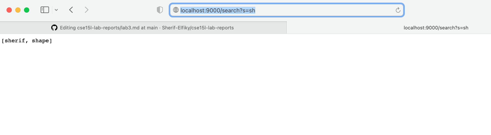

# Part 1
Code for the add:

```
ArrayList <String> words = new ArrayList<>();
else if (url.getPath().equals("/add")) {
            String[] newAddition = url.getQuery().split("=");
            if (newAddition[0].equals("s")) {
                words.add(newAddition[1]);
                return "new word added: " + newAddition[1];

            }
        }
        
```
Explanation of the add: We first start by checking if the path contains the /add. If so, we proceed to split the url query into an array. If the first element in the array is "s", then we can add that to our list of words. We also print "new word added " plus whatever word was added into our arraylist.
Here is a picture of how it looks when ran it by adding my name. Sherif gets added to the arraylist called words.
screenshot: 

Here I will add agaiin, but this time using the word shape. This adds the word shape to our arraylist called words.
screenshot:


Code for the search:
```

        else if (url.getPath().contains("/search")) {
            String [] parameters = url.getQuery().split("=");
            if (parameters[0].equals("s")){
            ArrayList<String> wordsWithSubstring = new ArrayList<>();
            String wordToSearch = parameters[1];
            for (String word : words) {
                if (word.contains(wordToSearch)){
                    wordsWithSubstring.add(word);
                }
            }
            return Arrays.toString(wordsWithSubstring.toArray());
        }

        }
```
Explantion of search: We first start by checking if search exists within our given path. We then create an array and see if the query has "s" at element[0]. If so we take the element at index 1 which is the word we want to search for within our arraylist we added to called words. We check every word in the arraylist words and if it contains the word we are searching for we add it to a new arraylist called wordsWithSubstring meaning they contain the word we are searching for. At the end of searching we return our array of words matching the given substring.

Here is a picture of me using the search on the words we previously added "sherif", "shape".
I will search for sh and it should return sherif and shape given they both contain the string sh.

As expected when we search for sh we get sherif and shape meaning our search worked!


# Part 2
**Bug 1**
**In ArrayExamples.java**
**The Reversed Method**
```
static int[] reversed(int[] arr) {
    int[] newArray = new int[arr.length];
    for(int i = 0; i < arr.length; i += 1) {
      arr[i] = newArray[arr.length - i - 1];
    }
    return arr;
  }
```

**The failure inducing input**
*Any input produced a failure in this code*
**The Symptom**
*An array filled with zeros*
**The Bug**
'arr[i]  = newArray[arr.length - i - 1];'
*actually intends the statement*
'newArr[i] = arr[arr.length - i - 1];'
**The Connection**

*When we initiliaze newArray it becomes an array of length (arr.length) with zero value.*
 *Then we need to set the value of each index in newArr to the value in newArr starting from the last index in order to reverse the array.*
 *But when it is arr = newArr instead arr justs gets set to all zeros and newArr is still an array with all zeros*

**Picture of code and test**


**Bug 2**
**In LinkedListExamples.java**

**The failure inducing input**
'
 LinkedList list = new LinkedList();
        list.append(1);
        list.append(2);
        list.append(3);
        list.append(4);
        list.append(5);
        list.append(6);
        list.append(7);
        assertEquals(7, n.last());
        '
**The Symptom**
*The assert equals fails because n.last() is null.

**The Bug**
'
while(n.next != null) {
            n = n.next;
        }
        return n.value;
     '
     *The problem here is that we are saying until n.next is not equal to null and on the last iteration we say n = n.next which would always return the last as null.
     This only affects lists with size > 2 because the lists smaller have other conditionals that return the correct value for last.
     

**The Connection**
The while loop should have a conditional that says if (n.next == null) break, so that we stop right at the last non-null value in the linkedlist.
*For some reason the test was not working properly in vscode, but I was able to deduce the output by reading through the code for last method.*
**Screenshot of the test**


