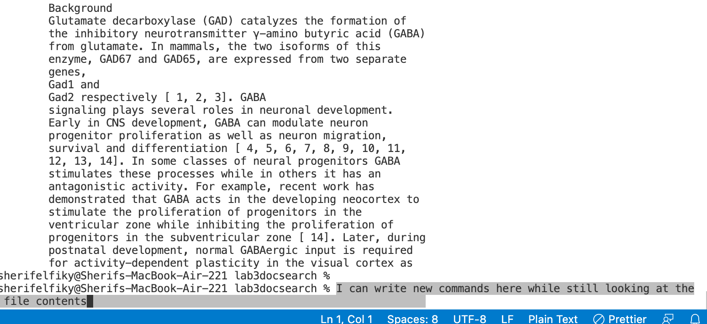
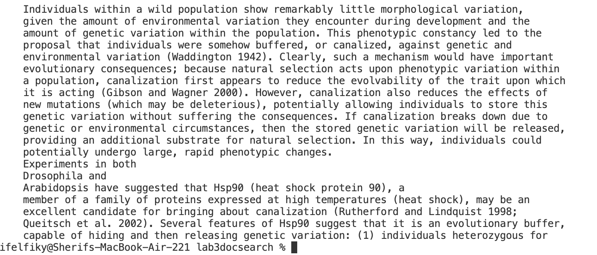

**Lab 3** <br>

**less** <br>
**(1)** <br>
One useful command option is less -N filename <br>
The -N will display line numbers of a file you choose. <br>
Here is an example of me using the code in technical/911report/chapter-1.txt <br>
the terminal commmands: <br>
```
less -N technical/911report/chapter-1.txt
```
screenshot: <br>

Here we used less -N to display the file numbers of chapter-1.txt. Note: some of the line numbers are repeated because the screenshot was not fullscreen, so some lines extend to a new line.

Lets display the line numbers for technical/government/About_LSC/Comments_on_semiannual.txt. <br>
```
less -N technical/government/About_LSC/Comments_on_semiannual.txt
```
screenshot:

Here we have the file Comments_on_semiannual.txt with line numbers shown upon entering the command above. <br>

Lastly we will display the line numbers for technical/biomed/1468-6708-3-3.txt. <br>
```
less -N technical/biomed/1468-6708-3-3.txt 
```
screenshot:


**(2)** <br>
Another useful command using less is less -X <filename> <br>
This command leaves the file contents open in the terminal after hitting q. So say if I wanted to do two less commands and have them available for reading I could use this instead of going back and forth between the two files. <br>
```
less -X technical/biomed/1471-213X-1-1.txt
```
 screenshot:
  
  In this command I used less -X to open technical/biomed/1471-213X-1-1.txt.
 In the terminal I wrote "I can write new commands here while still looking at the
 file contents" to show that I can write new commands whilst still looking at the ouput of less. <br>
 Lets show another example
 ```
  less -X  technical/plos/journal.pbio.0020001.txt
 ```
   
 
  Here I used less -X to open the contents of technical/plos/journal.pbio.0020019.txt so I could write new commands while still looking at the contents of this file. <br>
  The final example for less -X is as follows <br>
 ```
 less -X technical/biomed/1471-213X-1-2.txt
 ```
 
  screenshot 
  
  Here I used less -X again to keep the contents of technical/biomed/1471-213X-1-2.txt visible while still being able to type new commands.
  
  
  
 
 **(3)**


